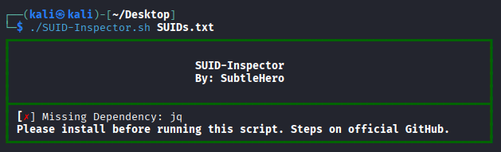
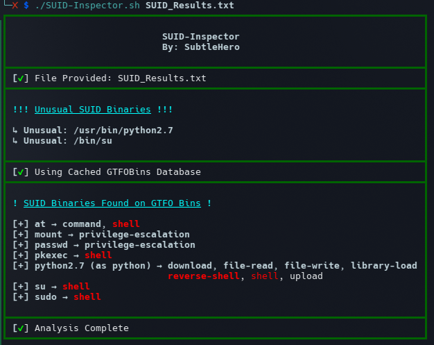

# SUID-Inspector

There have been many times (too many haha) during labs and certification practice where I missed an obvious privilege escalation path simply because I overlooked an unusual SUID binary or forgot to check one against GTFOBins.

I created SUID-Inspector to remove that guesswork.

Given a list of discovered SUID executables, SUID-Inspector analyzes each binary against a list of common SUID binaries and the GTFOBins database, highlighting those that may provide a path to privilege escalation. Instead of manually checking every SUID binary, the tool quickly identifies binaries with known GTFOBins entries while drawing attention to unusual or unexpected SUID executables that deserve further investigation.

Whether you're preparing for certifications like the OSCP, completing CTFs, or performing real-world penetration tests, SUID-Inspector is designed to make SUID enumeration faster, more efficient, and less prone to human error.

# Requirements

SUID-Inspector requires:

* `curl`
* `jq`

You may see the following output if you do not have one of the dependencies installed. I have provided copy and paste commands below.



### Install Dependencies

<details>
<summary><strong>Arch Linux</strong></summary>

```bash
sudo pacman -S curl jq
```

</details>

<details>
<summary><strong>Ubuntu / Debian / Kali / Parrot OS</strong></summary>

```bash
sudo apt install -y curl jq
```

</details>

<details>
<summary><strong>Fedora</strong></summary>

```bash
sudo dnf install curl jq
```

</details>

<details>
<summary><strong>openSUSE</strong></summary>

```bash
sudo zypper install curl jq
```

</details>

<details>
<summary><strong>Alpine Linux</strong></summary>

```bash
sudo apk add curl jq
```

</details>

# Installation

Step 1: Clone the repository

```bash
git clone https://github.com/SubtleHero/SUID-Inspector.git
```

Step 2: Change into the project directory

```bash
cd SUID-Inspector
```

Step 3: Make the script executable

```bash
chmod +x SUID-Inspector.sh
```

# Usage

Step 1: Enumerate SUID binaries on the target system

```bash
find / -perm -4000 -type f 2>/dev/null
```
or 
```bash
find / -perm -u=s -type f 2>/dev/null
```

Step 2: Copy and paste results into a file on host machine (I personally use gedit)

```bash
gedit SUID_Results.txt
```

Step 3: Run SUID-Inspector against the results

```bash
./SUID-Inspector.sh SUID_Results.txt
```

Output Example:



